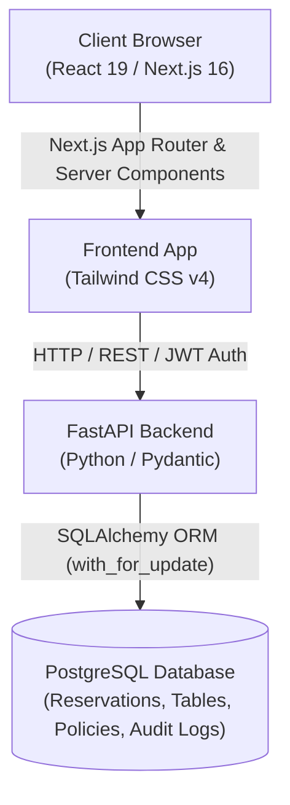

# Tablekeeper 🍽️

> **A table worth keeping.**  
> A competition-ready, end-to-end restaurant reservation platform built with **Next.js 16 (App Router, React 19, Tailwind CSS v4)**, **FastAPI**, **SQLAlchemy**, and **PostgreSQL**.

---

## 🌟 Executive Summary

Tablekeeper bridges high-touch hospitality and database reliability. Unlike traditional reservation prototypes that rely on volatile local storage or mock delays, Tablekeeper uses a **PostgreSQL-backed reservation and table engine** with row-level locking, atomic seating recovery, versioned policy management, and role-based owner management.

---

## 🚀 Key Features

### 1. Complete Customer Experience
- **Restaurant Discovery & Filtering**: Search across cuisines, locations, price tiers, and guest ratings with rich imagery and curated menus.
- **Interactive Seating Floor Plan**: Visual real-time table layout with instant conflict checks against active backend reservations.
- **Mandatory Policy Acceptance**: Customers review and explicitly accept versioned restaurant policies (cancellation window, holding grace periods, maximum party sizes) stored with their booking.
- **Authoritative Booking Confirmation**: Returns database-generated booking references (`TK-XXXXXXXX`), persistent reservation tickets, and instant email reference tags.
- **My Reservations Hub**: Filter by all, upcoming, or past bookings; retrieve live statuses (`confirmed`, `seated`, `completed`, `cancelled`); and cancel reservations with instant table availability restoration.

### 2. Full Restaurant Owner Portal (`/owner`)
- **Role-Based Access Control**: Secure JWT authentication ensuring restaurant owners can only inspect and manage their authorized restaurant portfolio.
- **Real-Time Overview & Metrics**: Live daily bookings counter, seated diners tracker, active operational tables, and maintenance alerts.
- **Live Floor Plan & Occupancy**: Visual status grid for all tables with instant action buttons to seat guests, mark bookings completed, or reallocate tables.
- **Reservations Management**: Full search and date filtering, guest contact details, special dietary requests, and one-click status transitions.
- **Atomic Table Reassignment**: Move guests between tables with capacity validation, conflict prevention, and complete audit logging.

### 3. Seating Recovery & Operational Reliability
- **Maintenance Mode Toggle**: Take damaged or reserved tables offline with a single click.
- **Automated Seating Recovery Workflow**:
  1. *Detect*: Automatically identifies all active reservations scheduled on the affected table.
  2. *Recommend*: Generates conflict-free alternative table suggestions matching required party capacities.
  3. *Preview*: Allows owners to review and adjust proposed seating moves.
  4. *Atomic Execution*: Safely executes all reassignments in a single database transaction.
- **Table Assignment Audit Trail**: Tracks historical table moves with timestamps, prior/new table numbers, and change reasons (`table_assignment_history`).

### 4. Dynamic Policy Management & Versioning
- **Owner Policy Configuration**: Configurable cancellation hours, late-arrival grace periods, reservation durations, and dining guidelines.
- **Effective Versioning**: Saving policy updates automatically increments the restaurant's `policy_version`, guaranteeing historical bookings preserve the terms agreed to at checkout.

---

## 🏗️ Architecture & Tech Stack



| Layer | Technology |
|---|---|
| **Frontend** | Next.js 16.3.8 (App Router), React 19, TypeScript, Tailwind CSS v4, Context Auth |
| **Backend** | FastAPI, Pydantic v2, Python 3.14, Starlette, Uvicorn |
| **Database** | PostgreSQL, SQLAlchemy 2.0 (Row-Level Locking), Alembic Migrations |
| **Security** | Argon2 Password Hashing, JWT Bearer Token Authentication, RBAC |

---

## ⚡ Quick Start Guide

### 1. Database Setup
Ensure PostgreSQL is running locally on port `5432` with database `tablekeeper` and user `tablekeeper`:
```bash
# In backend directory
cd tablekeeper/backend/backend

# Activate virtual environment
.\.venv\Scripts\Activate.ps1

# Run database migrations
python -m alembic upgrade head

# Seed demo restaurants, tables, and accounts
python scripts/seed_database.py
```

### 2. Start Backend
```bash
cd tablekeeper/backend/backend
.\.venv\Scripts\uvicorn.exe app.main:app --reload --host 127.0.0.1 --port 8000
```
Backend API will be accessible at `http://127.0.0.1:8000`.  
Swagger interactive documentation at `http://127.0.0.1:8000/docs`.

### 3. Start Frontend
```bash
cd tablekeeper/frontend
npm run dev
```
Frontend will be accessible at `http://localhost:3000`.

---

## 🔑 Demo Accounts

Quick one-click login buttons are available on the login page:

| Role | Email | Password | Access Level |
|---|---|---|---|
| **Restaurant Owner** | `owner@example.com` | `OwnerDemo123!` | Access to Owner Dashboard (`/owner`), seating recovery, tables & policy management |
| **Diner / Customer** | `customer@example.com` | `CustomerDemo123!` | Table discovery, reservations checkout, policy acceptance, and cancellation |

---

## 🧪 Automated Test Suite

A test suite verifying customer flows, owner operations, concurrency locking, and seating recovery is included:

```bash
cd tablekeeper/backend/backend
python -m unittest tests.test_full_platform
```

### Tests Covered:
- `test_01_user_registration_and_authentication`: Validates customer and owner registration and JWT issuance.
- `test_02_policy_retrieval_and_restaurant_discovery`: Validates restaurant listing and policy endpoints.
- `test_03_table_availability_and_reservation_creation`: Validates slot checking, booking creation with policy versioning, double-booking prevention under concurrency, and cancellation availability restoration.
- `test_04_owner_seating_recovery_and_audit_history`: Validates maintenance toggle, atomic seating recovery execution, and assignment audit logs.
- `test_05_policy_update_and_versioning`: Validates policy updates and automatic version incrementing.

---

## 📄 License
MIT License. Created for the Hackathon Submission.
